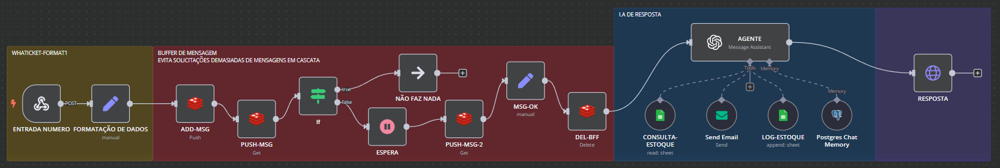
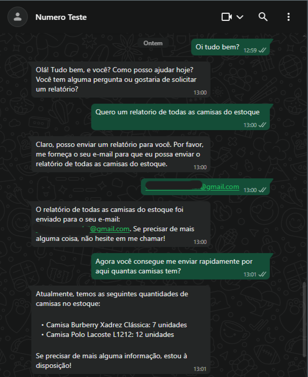
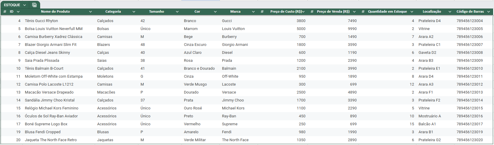

# Desafio N8N – Consulta Inteligente via WhatsApp

Este projeto é uma automação construída no N8N que permite receber perguntas via WhatsApp, interpretar a intenção da mensagem com uso de IA, consultar uma planilha de estoque no Google Sheets e responder ao usuário com as informações relevantes.

## 💡 Funcionalidades

- **Webhook de Entrada (WhatsApp)**: A automação é iniciada por uma mensagem recebida via Webhook integrado ao meu sistema Whaticket.
- **Formatação e Buffer**: A mensagem é normalizada e armazenada temporariamente em Redis para controle de fluxo e prevenção de mensagens em cascata.
- **Consulta ao Estoque**: Se a mensagem se tratar de uma solicitação de relatório, a automação acessa uma planilha no Google Sheets para consultar os dados.
- **Assistente de IA**: Para perguntas em linguagem natural, a mensagem é enviada a um agente de IA (OpenAI) que responde com base no contexto.
- **Histórico com Memória**: Utiliza integração com banco de dados PostgreSQL para manter a memória da conversa, fornecendo respostas mais coerentes em interações contínuas.
- **Envio de Resposta**: A resposta gerada é enviada de volta ao número do usuário via API.
- **Registro de Logs**: Cada interação é registrada em outra planilha do Google Sheets para fins de auditoria e melhoria contínua.

## 🛠️ Tecnologias e Ferramentas

- N8N– Orquestrador de automações
- Redis – Controle de mensagens e filas temporárias
- Google Sheets – Armazenamento de dados de estoque e logs
- OpenAI – Agente de linguagem natural
- PostgreSQL – Armazenamento da memória contextual da conversa
- Whaticket – Interface de comunicação via WhatsApp

## 📷 Fotos do projeto

## ⚠️ Considerações

Entendo que este desafio tem como objetivo avaliar minha capacidade de integração e automação com N8N. A proposta foi executada com sucesso, porém ressalto algumas limitações:

### 🔁 Instabilidade do Google Sheets

Embora o uso do Google Sheets seja conveniente, ele pode não ser a melhor escolha em ambientes de produção por conta de:

- **Latência nas respostas**: A API pode ser lenta, especialmente com planilhas grandes ou com fórmulas.
- **Conflito de edição simultânea**: Atualizações concorrentes comprometem a consistência dos dados.
- **Limitações para busca estruturada**: O acesso a dados exige mapeamentos rígidos, dificultando flexibilidade e performance.

## 🔄 Evolução Natural

Para um ambiente real, substituiria o Google Sheets por um **banco relacional como PostgreSQL ou Supabase**, o que permitiria:

- Consultas mais rápidas e otimizadas com SQL
- Maior controle sobre consistência e integridade dos dados
- Integração eficiente com o agente de IA por meio de mecanismos de busca e memória contextual estruturada

### 🎯 Imprevisibilidade da IA

Devido ao escopo reduzido do projeto e à ausência de uma base robusta de dados e testes, a IA pode apresentar variações nas respostas para perguntas semelhantes. Essa imprevisibilidade é comum quando:

- O contexto da conversa é limitado
- As instruções passadas ao agente de linguagem são genéricas
- Faltam mecanismos de reforço ou validação da resposta final

Com mais tempo, eu priorizaria melhorias nessa parte, trabalhando no ajuste fino dos prompts, na padronização das respostas. 
O objetivo seria garantir que a IA respondesse com consistência cada vez maior, reduzindo ambiguidades e melhorando a experiência do usuário final.

